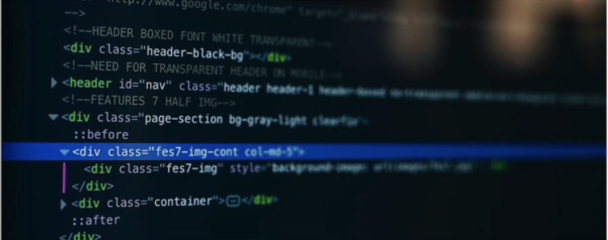

# HTML fundamentals notes
from https://adp-gptlearning.udemy.com/course/design-and-develop-a-killer-website-with-html5-and-css3/?learning_path_id=601838#overview

## Skeleton 
```
<!DOCTYPE html>
<html lang="en>
    <head>
    <meta charset="UTF-8"/>
    <title>The Basic Language of the Web: HTML</title>
    </head>

    <body>

    <h1>The Code Magazine</h1>
    <p>This is a paragraph</p>

    </body>

</html>

```

## Image
```

```
## Link  (anchor element with href)
```
<a href="https://developer.mozilla.org/en-US/docs/Web/HTML">MDN Web Docs</a>
```
## Open URL in new tab 
```
<a href="https://developer.mozilla.org/en-US/docs/Web/HTML">
target="_blank"
MDN Web Docs</a>
```
## Link to internal page 
```
<a href="blog.html">Blog</a>
```
## Placeholder Link
```
<a href="#">Challenges</a>
```

## Navigation Bar
```
    <nav>
    <a href="blog.html">Blog</a>
    <a href="#">Challenges</a>
    <a href="#">FlexBox</a>
    <a href="#">CSS Grid</a>
    </nav>
```

## Header
```
    <header>
    <h1>The Code Magazine</h1>

    <nav>
    <a href="blog.html">Blog</a>
    <a href="#">Challenges</a>
    <a href="#">FlexBox</a>
    <a href="#">CSS Grid</a>
    </nav>
    
    </header>
```
## Footer
```
<footer>
</footer>
```